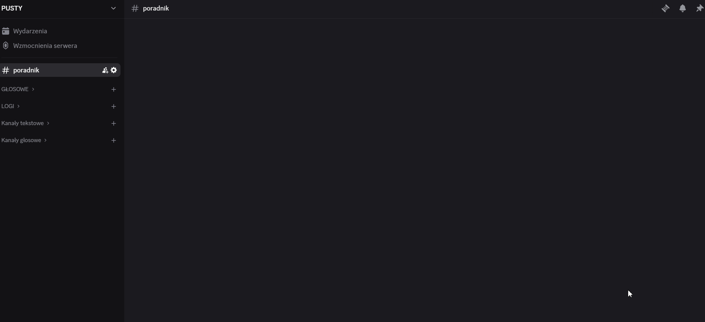

## Nawigacja
!> Nie wpisuj dosłownie `<` `>` `[` `]` `|` itp.

## Komendy

### Szybki spis komend<!-- {docsify-ignore} -->
<!-- tabs:start -->

<!-- tab:Administracyjne -->

|Nazwa|Opis|
| --- | -- |
|**/nick_bot** [nick]|Ustawia nick bota na serwerze|
|**/wiad** [kanał] [treść]| Wysyła treść na podany kanał w imieniu bota|
<!-- tab:Moderacyjne -->
!>Komend __Moderacyjnych__ może użyć **każdy** kto ma permisje do usuwania wiadomości!              
Dlatego ważna jest zmiana permisji komend w 
``Ustawienia serwera->integracje->Mathewu``

|Nazwa|Opis|
| --- | -- |
|**/UserInfo** [user]| Przesyła wszystkie dostępne informacje o userze wraz z jego mutami, banami itp.
|**/warn** [user] [powód]| Ostrzega użytkownika na PW
|**/mute** [user] [czas] [powód]| Nadaje discordowego timeout'a na podaną ilość czasu
|**/unmute** [user] [czas] [powiadomienie]| Odmutowywuje usera z powiadomieniem lub bez na PW
|**/kick** [user] [powód]| Wyrzuca usera z serwera
|**/ban** [user] [powód] [powiadomienie]| Banuje usera z serwera wraz z powiadomieniem lub bez na PW
|**/scamban** [user]|Banuje użytkownika wysyłającego podejrzane linki oraz usuwa jego wiadomości 2 dni wstecz
|**/unban** [ID] (powód bana) [powód unbana]| Odbanowywuje osobę, ``(powód bana)`` nie jest wymagany
|**/nick** [user]|Zmienia nick podanego usera
|**/bulk** [ilość]|Usuwa daną ilość wiadomości na kanale
|**edytuj** [rola] <small>(message menu)</small>| Edytuje wiadomość bota (tylko tekst)
|**/przypnij** [wiadomość]|Przypina daną wiadomość na kanale w imieniu bota
|**/ilerola** [rola]|Ile użytkowników posiada daną rolę
|/czasowa [user] [ranga] [dni] |<small>Do zrobienia</small>|
|/nadajrole [user] [ranga] |<small>Do zrobienia</small>|
|/usunrole  [user] [ranga] |<small>Do zrobienia</small>|
<!-- tab:Publiczne -->
|Nazwa|Opis|
| --- | ---|
|**/AvatarURL** [user]|Przesyła avatar danego użytkownika w pełnej rozdzielczości
|**/przypomnij** [czas] [oczym]|Przypomina autorowi komendy o danej rzeczy
|**zgłoś wiadomość** <small>(message menu)</small>|Zgłasza wiadomość użytkownika wraz z jego wiadomością
|**zgłoś użytkownika** <small>(user menu)</small>|Zgłasza użytkownika
<!-- tab:Fun -->
|Nazwa|Opis|
| --- | -- |
|**/kot**|Wysyła randomowe zdjęcie kotka|
|**/pies**|Wysyła randomowe zdjęcie psa|
|**/zwierze** [typ]|Wysyła randomowe zdjęcie wybranego typu zwierzęcia|
|**/random** [od] [do]| Losuje randomową liczbę w podanym zakresie|
<!-- tab:Ustawienia serwera -->
|Nazwa|Opis|
| --- | -- |
|**/startup**|Tworzy kanały log'a gdy ich nie posiadamy oraz zapisuje ich ``ID``|
|**/ustawienia-serwera**| Zarządzanie wszystkimi zapisanymi kanałami|
|**/ustawienia-sugestii** [kanał]|Ustawia kanał [kanał] jako sugestie|
|**/ustawienia-przywitania** [kanał] [obraz]| Ustawia kanał [kanał] jako przywitalnia dla nowych członków |
|/ticket| <small>Do zrobienia</small> |
<!-- tab:Bot owner -->
``/stop`` ``/restart`` ``/aktywnosc [typ] [nazwa]`` ``/leave_server [ID]`` ``/nodejs``

<!-- tab:Custom commands -->
<h2>Mogaro & Reiko</h2>

 - **Komendy**
   - ``/ticket-mogaro`` ``/giw`` ``/ilepatronów`` ``/czat`` ``/level`` ``/odc`` ``/odcplus`` ``/strony`` ``/patronite`` ``/ranking`` 
 - **Eventy**
   - ``propozycje tłumaczeń`` ``https delete`` ``RSS Blog`` ``Statystyki vc kanał`` ``auto level`` ``Team_emails`` ``email_mod``
---

<!-- tabs:end -->

## Eventy<!-- {docsify-ignore} -->
  - Sugestia
  - Reakcje [propozycja tłumaczeń] [Dzień dobry] [Miłego dnia]
  - Responder [Dobranoc]

## TempVoice <small>BETA</small><!-- {docsify-ignore} -->
``/upoważnij`` ``/temp-menu`` ``/temp-voice``

## Profil <small>BETA</small><!-- {docsify-ignore} -->
``/profil`` ``/profil-ustawienia``

## Ticket <small>Do zrobienia</small><!-- {docsify-ignore} -->
``/ticket``
