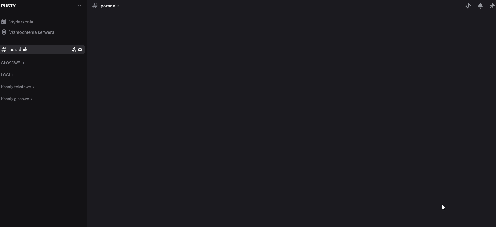

# MathewuBot <small>``V1.0.0``</small> <!-- {docsify-ignore} -->
Konfigurowalny, wielofunkcyjny bot Discord. 

>Strona w budowie - **Discord contact:**  [mathew733](https://discordapp.com/users/294911538848858112) 

### Szybki spis komend<!-- {docsify-ignore} -->
!> Nie wpisuj dosłownie `<` `>` `[` `]` `|` itp.

<!-- tabs:start -->

<!-- tab:Publiczne -->
|Nazwa|Opis|
| --- | ---|
|**/profil** (user)|Ładuje profil użytkownika
|**/profil-ustawienia** [ustaw/usuń wszystko] (o mnie,Anilist/shinden/mal,Ulubiona seria/postać,Banner, Kolor)|Ustawia profil użytkownika
|**/dokumentacja**, **/komendy**| Wysyła link do Docs
|**/AvatarURL** [user]|Przesyła avatar danego użytkownika w pełnej rozdzielczości
|**/przypomnij** [czas] [oczym]|Przypomina autorowi komendy o danej rzeczy
|**zgłoś wiadomość** <small>(message menu)</small>|Zgłasza wiadomość użytkownika wraz z jego wiadomością
|**zgłoś użytkownika** <small>(user menu)</small>|Zgłasza użytkownika
<!-- tab:Fun -->
|Nazwa|Opis|
| --- | -- |
|**/kot**|Wysyła randomowe zdjęcie kotka|
|**/pies**|Wysyła randomowe zdjęcie psa|
|**/zwierze** [typ]|Wysyła randomowe zdjęcie wybranego typu zwierzęcia|
|**/random** [od] [do]| Losuje randomową liczbę w podanym zakresie|
<!-- tab:Moderacyjne -->
!>Komend __Moderacyjnych__ może użyć **każdy** kto ma permisje do usuwania wiadomości!              
Dlatego ważna jest zmiana permisji komend w 
``Ustawienia serwera->integracje->Mathewu``

?> Osoby z permisją ``zarządzanie wiadomościami`` nie mogą zostać zmutowani, wyrzuceni czy zbanowani.ㅤㅤㅤㅤㅤㅤㅤㅤUprawnienie ``zarządzanie wiadomościami+zarządzanie serwerem``, ``Administrator`` nadpisuje tę zasadę.

|Nazwa|Opis|
| --- | -- |
|**/UserInfo** [user]| Przesyła wszystkie dostępne informacje o userze wraz z jego mutami, banami itp.
|**/warn** [user] [powód]| Ostrzega użytkownika na PW
|**/mute** [user] [czas] [powód]| Nadaje discordowego timeout'a na podaną ilość czasu
|**/unmute** [user] [czas] [powiadomienie]| Odmutowywuje usera z powiadomieniem lub bez na PW
|**/kick** [user] [powód]| Wyrzuca usera z serwera
|**/ban** [user] [powód] [powiadomienie]| Banuje usera z serwera wraz z powiadomieniem lub bez na PW
|**/scamban** [user]|Banuje użytkownika wysyłającego podejrzane linki oraz usuwa jego wiadomości 2 dni wstecz
|**/unban** [ID] (powód bana) [powód unbana]| Odbanowywuje osobę, ``(powód bana)`` nie jest wymagany
|**/nick** [user]|Zmienia nick podanego usera
|**/bulk** [ilość]|Usuwa daną ilość wiadomości na kanale
|**/przypnij** [wiadomość]|Przypina daną wiadomość na kanale w imieniu bota
|**/ilerola** [rola]|Ile użytkowników posiada daną rolę
|**/invite_info** [invite]|Informacje o zaproszeniu
<!-- tab:Administracyjne -->
?> Tylko ``Administrator`` ``Zarządzanie serwerem`` może użyć tych komend.

|Nazwa|Opis|
| --- | -- |
|**/nick_bot** [nick]|Zmienia nick bota na serwerze|
|**/wiad** [kanał] [treść]| Wysyła treść na podany kanał w imieniu bota|
|**edytuj** <small>(message menu)</small>| Edytuje wiadomość bota (tylko tekst)
|**/invite_utwórz** [kanał] [liczba]|Tworzy zaproszenie serwera w imieniu bota|
|**/server_info**| Informacje o serwerze
<!-- tab:Ustawienia serwera -->
?> Tylko ``Administrator`` może użyć tych komend. Komendy nie są idiotoodporne!

|Nazwa|Opis|
| --- | -- |
|**/startup**|Tworzy kanały log'a gdy ich nie posiadamy oraz zapisuje ich ``ID``|
|**/ustawienia-serwera**| Zarządzanie wszystkimi zapisanymi kanałami <small>*Pamiętaj aby w ticket-category oznaczyć kategorie! nie kanał!*</small>|
|**/ustawienia-sugestii** [kanał]|Ustawia kanał [kanał] jako sugestie|
|**/ustawienia-przywitania** [kanał] [obraz]| Ustawia kanał [kanał] jako przywitalnia dla nowych członków |
|**/ticket** [prześlij/ustaw] (opis) (tytuł)| Przesyła ticket menu na kanał oraz ustawia odpowiednie kanały |
|**/transkrypt** | Tworzy transkrypt całego kanału |
<!-- tab:Bot Owner -->
``/stop`` ``/restart`` ``/aktywnosc [typ] [nazwa]`` ``/leave_server [ID]`` ``!nodejs`` ``BotJoin`` ``!botinfo`` ``/ustawienia-ticket``

<!-- tab:Custom commands -->
<h2>Mogaro & Reiko</h2>

 - **Komendy**
   - ``/ticket-mogaro`` ``/giw`` ``/ilepatronów`` ``/czat`` ``/level`` ``/odc`` ``/odcplus`` ``/strony`` ``/patronite`` ``/ranking`` 
 - **Eventy**
   - ``propozycje tłumaczeń`` ``https delete`` ``RSS Blog`` ``Statystyki vc kanał`` ``auto level``
---
<medium> Po customowe komendy skontaktuj się z [mathew733](https://discordapp.com/users/294911538848858112) </medium>
<!-- tabs:end -->
